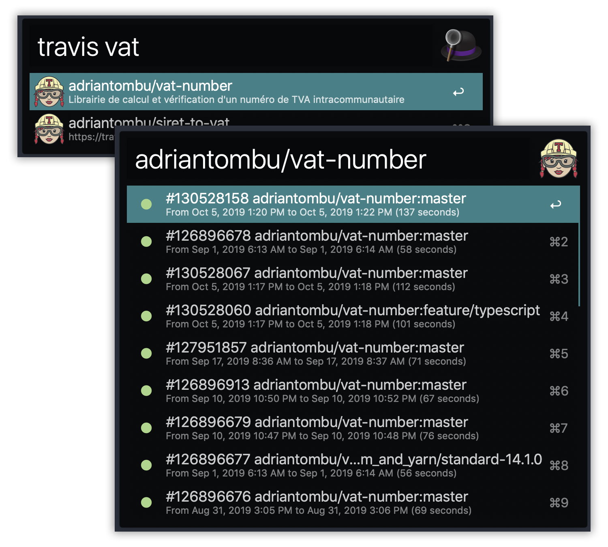

# alfred-travis-ci [](https://badge.fury.io/js/%40adriantombu%2Falfred-travis-ci) [](https://offset.earth/adrian)

> [Alfred 3](https://www.alfredapp.com) workflow to check your Travis builds



## Install

```
$ npm install --global @adriantombu/alfred-travis-ci
```

*Requires [Node.js](https://nodejs.org) 8+ and the Alfred [Powerpack](https://www.alfredapp.com/powerpack/).*

## Usage

### Configure the workflow

In Alfred, type `travis-auth YOUR-TRAVIS-TOKEN` + <kbd>Enter</kbd> to save your Travis token, where`YOUR-TRAVIS-TOKEN` can be found in the [Travis Settings](https://travis-ci.com/account/preferences) under the API authentication section.

### Refresh your repositories
In Alfred, type `travis-update` + <kbd>Enter</kbd> to refresh the list of your repositories.

### Display your builds
In Alfred, type `travis YOUR-REPO-NAME` + <kbd>Enter</kbd> to select the repository that you want to display the builds.

Then select the build and <kbd>Enter</kbd> to show the page on your browser.

## License

MIT © [Adrian Tombu](https://otso.fr)
